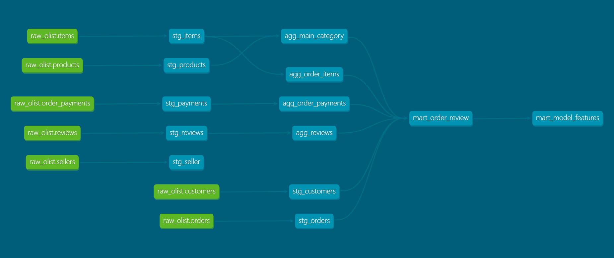

# Olist Review Analysis

## 概要

ブラジルのECサイト **Olist E-commerce Dataset** を用いて、レビュー低評価（★1〜2）の発生要因分析と予測モデルの構築を実施した。

本プロジェクトでは、単なる機械学習モデルの構築だけではなく、

* BigQueryによるデータウェアハウス構築
* dbtによるデータ変換パイプラインの実装
* EDA（探索的データ分析）
* 機械学習による予測
* SHAPによるモデル解釈
* ビジネス改善提案

まで、一連のデータ分析プロジェクトを実装している。

---

# 全体アーキテクチャ

```text
Olist Dataset
      │
      ▼
BigQuery (Raw)
      │
      ▼
dbt
├── Staging
├── Intermediate
└── Mart
      │
      ▼
Python
├── Data Quality Check
├── EDA
├── Feature Engineering
├── Machine Learning
└── SHAP
      │
      ▼
Business Recommendation
```

---

# 分析目的

ECサイト運営ではレビュー評価は顧客満足度を表す重要な指標である。

本分析では、

* どのような要因が低評価レビューにつながるのか
* 改善可能な要因は何か
* 購入時点の情報のみを利用して低評価を予測できるか

を明らかにすることを目的とした。

---

# 使用データ

**Olist Brazilian E-Commerce Public Dataset**

分析単位

**1注文 = 1レコード**

| 項目    |      値 |
| ----- | -----: |
| レコード数 | 99,441 |
| カラム数  |     15 |

---

# 使用技術

## Data Warehouse

* Google BigQuery
* dbt

## SQL

* BigQuery SQL
* 集計テーブル作成
* 特徴量テーブル作成
* データ変換パイプライン構築

## Python

* Pandas
* NumPy
* Matplotlib
* Seaborn
* Scikit-learn
* XGBoost
* SHAP

---

# dbt Data Pipeline

特徴量作成までのSQLをdbtで管理し、レイヤー構造を持つデータ変換パイプラインを構築した。

```
Raw
│
├── Staging
│      Rawデータ整形
│
├── Intermediate
│      注文単位集約
│
└── Mart
       モデル学習用特徴量
```

## 主なモデル

### Staging

* stg_orders
* stg_customers
* stg_items
* stg_products
* stg_payments
* stg_reviews
* stg_seller

### Intermediate

* agg_order_items
* agg_order_payments
* agg_reviews
* agg_main_category

### Mart

* mart_order_review
* mart_model_features

---

# dbt Lineage

dbt Docs によりモデル間の依存関係を可視化している。



---

# 分析フロー

## Step1 Data Quality Check

実施内容

* 欠損値確認
* 注文ステータス確認
* レビュー分布確認

成果物

* docs/data_quality_policy.md

---

## Step2 Exploratory Data Analysis (EDA)

以下の仮説を検証した。

* 配送遅延が大きいほど低評価になりやすい
* 送料が高いほど低評価になりやすい
* 商品カテゴリによって低評価率が異なる
* 地域によって低評価率が異なる

成果物

* docs/eda_summary.md

---

## Step3 Feature Engineering

購入時点で利用可能な情報のみを利用して特徴量を作成した。

主な特徴量

* item_count
* total_price
* total_freight
* total_payment
* purchase_weekday
* purchase_hour
* customer_state
* payment_type
* main_category
* freight_ratio

---

## Step4 Modeling

構築モデル

* Logistic Regression
* Random Forest
* XGBoost

評価指標

* Accuracy
* Precision
* Recall
* F1-score
* ROC-AUC

成果物

* docs/modeling_summary.md

---

## Step5 Explainability

SHAPを利用して予測根拠を分析した。

重要特徴量

1. delay_days
2. delivery_days
3. item_count
4. total_freight
5. total_payment

---

## Step6 Business Recommendation

分析結果を基に改善施策を提案した。

主な提言

* 配送品質の改善
* 多商品注文への品質管理強化
* 高送料商品のUX改善
* 高リスクカテゴリの重点管理

成果物

* docs/business_recommendation.md

---

# 主な分析結果

## EDA

| 指標   |   高評価 |   低評価 |
| ---- | ----: | ----: |
| 配送日数 | 10.9日 | 19.7日 |
| 配送遅延 | 0.23日 | 3.91日 |
| 送料   |  22.0 |  27.7 |

配送品質および送料がレビュー評価と強い関連を持つことを確認した。

---

## モデル分析

Random Forest および XGBoost により、配送関連特徴量の重要度が高いことを確認した。

SHAP分析では、

* 配送遅延
* 配送日数
* 商品数
* 送料

がレビュー低評価に大きく寄与していることが確認された。

---

# ディレクトリ構成

```text
.
├── data
├── docs
│   ├── images
│   │   └── lineage.png
│   ├── business_recommendation.md
│   ├── data_quality_policy.md
│   ├── eda_summary.md
│   └── modeling_summary.md
│
├── notebooks
│   ├── 01_data_quality.ipynb
│   ├── 02_eda.ipynb
│   └── 03_modeling.ipynb
│
├── olist_dbt
│   ├── models
│   │   ├── staging
│   │   ├── intermediate
│   │   └── marts
│   ├── macros
│   ├── dbt_project.yml
│   └── profiles.yml
│
├── requirements.txt
└── README.md
```

---

# 再現方法

## 1. Python環境

```bash
pip install -r requirements.txt
```

## 2. dbt

```bash
cd olist_dbt

dbt debug
dbt run
dbt docs generate
dbt docs serve
```

---

# 学んだこと

* BigQuery上で分析用データマートを構築する方法
* dbtを利用したデータ変換パイプラインの設計
* SQLモデルの依存関係管理
* データ品質確認から特徴量作成までを再利用可能な形で実装する方法
* EDAと機械学習では利用可能な特徴量が異なること
* SHAPによるモデル解釈の重要性
* データ分析だけでなく、データ基盤構築から分析・可視化・モデル構築まで一貫したワークフローを構築する重要性
